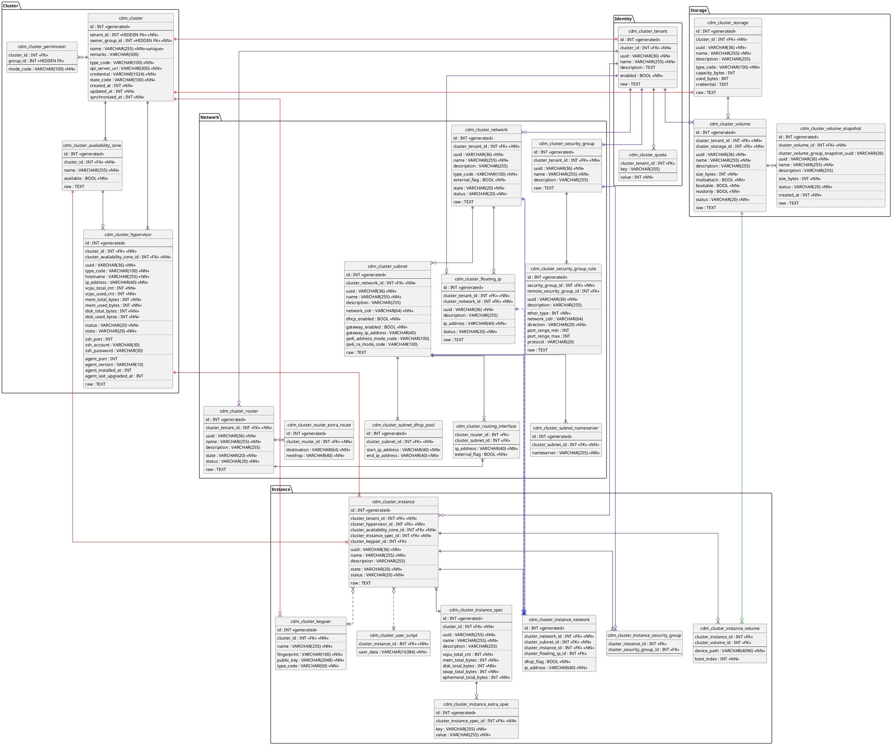

# DataBase

## 스크립트
### Cluster Manager
* [DDL 스크립트](cdm-cluster-manager.ddl)
* [DML 스크립트](cdm-cluster-manager.dml)
---

## ERD
### Cluster Manager

```plantuml
@startuml

hide circle
skinparam linetype ortho

package Cluster {

  entity cdm_cluster {
    id : INT <<generated>>
    --
    tenant_id : INT <<HIDDEN FK>> <<NN>>
    owner_group_id : INT <<HIDDEN FK>> <<NN>>
    ..
    name : VARCHAR(255) <<NN>><<unique>>
    remarks : VARCHAR(300)
    ..
    type_code : VARCHAR(100) <<NN>>
    api_server_url : VARCHAR(300) <<NN>>
    credential : VARCHAR(1024) <<NN>>
    state_code : VARCHAR(100) <<NN>>
    created_at : INT <<NN>>
    updated_at : INT <<NN>>
    synchronized_at : INT <<NN>>
  }

  entity cdm_cluster_permission {
    cluster_id : INT <<FK>>
    group_id : INT <<HIDDEN FK>>
    --
    mode_code : VARCHAR(100) <<NN>>
  }
  
  entity cdm_cluster_availability_zone {
    id : INT <<generated>>
    --
    cluster_id : INT <<FK>> <<NN>>
    ..
    name : VARCHAR(255) <<NN>>
    ..
    available : BOOL <<NN>>
    ..
    raw : TEXT
  }

  entity cdm_cluster_hypervisor {
    id : INT <<generated>>
    --
    cluster_id : INT <<FK>> <<NN>>
    cluster_availability_zone_id : INT <<FK>> <<NN>>
    ..
    uuid : VARCHAR(36) <<NN>>
    type_code : VARCHAR(100) <<NN>>
    hostname : VARCHAR(255) <<NN>>
    ip_address : VARCHAR(40) <<NN>>
    vcpu_total_cnt : INT <<NN>>
    vcpu_used_cnt : INT <<NN>>
    mem_total_bytes : INT <<NN>>
    mem_used_bytes : INT <<NN>>
    disk_total_bytes : INT <<NN>>
    disk_used_bytes : INT <<NN>>
    ..
    status : VARCHAR(20) <<NN>>
    state : VARCHAR(20) <<NN>>
    ..
    ssh_port : INT
    ssh_account : VARCHAR(30)
    ssh_password : VARCHAR(30)
    ..
    agent_port : INT
    agent_version : VARCHAR(10)
    agent_installed_at : INT
    agent_last_upgraded_at : INT
    ..
    raw : TEXT
  }
  
cdm_cluster_permission }o-|| cdm_cluster

cdm_cluster ||--|{ cdm_cluster_hypervisor
cdm_cluster ||--|{ cdm_cluster_availability_zone

cdm_cluster_availability_zone ||--o{ cdm_cluster_hypervisor

}

package Identity {
  entity cdm_cluster_quota { 
    cluster_tenant_id : INT <<FK>>
    key : VARCHAR(255)
    --
    value : INT <<NN>>
  }

  entity cdm_cluster_tenant {
    id : INT <<generated>>
    --
    cluster_id : INT <<FK>> <<NN>>
    ..
    uuid : VARCHAR(36) <<NN>>
    name : VARCHAR(255) <<NN>>
    description : TEXT
    ..
    enabled : BOOL <<NN>>
    ..
    raw : TEXT
  }

cdm_cluster_tenant ||--o{ cdm_cluster_quota
}

package Storage {

  entity cdm_cluster_storage {
    id : INT <<generated>>
    --
    cluster_id : INT <<FK>> <<NN>>
    ..
    uuid : VARCHAR(36) <<NN>>
    name : VARCHAR(255) <<NN>>
    description : VARCHAR(255)
    ..
    type_code : VARCHAR(100) <<NN>>
    capacity_bytes : INT
    used_bytes : INT
    credential : TEXT
    ..
    raw : TEXT
  }
  
  entity cdm_cluster_volume {
    id : INT <<generated>>
    --
    cluster_tenant_id : INT <<FK>> <<NN>>
    cluster_storage_id : INT <<FK>> <<NN>>
    ..
    uuid : VARCHAR(36) <<NN>>
    name : VARCHAR(255) <<NN>>
    description : VARCHAR(255)
    ..
    size_bytes : INT <<NN>>
    multiattach : BOOL <<NN>>
    bootable : BOOL <<NN>>
    readonly : BOOL <<NN>>
    ..
    status : VARCHAR(20) <<NN>>
    ..
    raw : TEXT
  }
  
  entity cdm_cluster_volume_snapshot {
    id : INT <<generated>>
    --
    cluster_volume_id : INT <<FK>> <<NN>>
    ..
    cluster_volume_group_snapshot_uuid : VARCHAR(36)
    uuid : VARCHAR(36) <<NN>>
    name : VARCHAR(255) <<NN>>
    description : VARCHAR(255)
    ..
    size_bytes : INT <<NN>>
    ..
    status : VARCHAR(20) <<NN>>
    ..
    created_at : INT <<NN>>
    ..
    raw : TEXT
  }
  
cdm_cluster_storage ||--o{ cdm_cluster_volume
cdm_cluster_volume ||-o{ cdm_cluster_volume_snapshot
}

package Instance {

  entity cdm_cluster_user_script {
    cluster_instance_id : INT <<FK>> <<NN>>
    --
    user_data : VARCHAR(16384) <<NN>>
  }
  
  entity cdm_cluster_keypair {
    id : INT <<generated>>
    --
    cluster_id : INT <<FK>> <<NN>>
    ..
    name : VARCHAR(255) <<NN>>
    ..
    fingerprint : VARCHAR(100) <<NN>>
    public_key : VARCHAR(2048) <<NN>>
    type_code : VARCHAR(50) <<NN>>
  }

  entity cdm_cluster_instance_network {
    id : INT <<generated>>
    --
    cluster_network_id : INT <<FK>> <<NN>>
    cluster_subnet_id : INT <<FK>> <<NN>>
    cluster_instance_id : INT <<FK>> <<NN>>
    cluster_floating_ip_id : INT <<FK>>
    ..
    dhcp_flag : BOOL <<NN>>
    ip_address : VARCHAR(40) <<NN>>
  }
  
  entity cdm_cluster_instance {
    id : INT <<generated>>
    --
    cluster_tenant_id : INT <<FK>> <<NN>>
    cluster_hypervisor_id : INT <<FK>> <<NN>>
    cluster_availability_zone_id : INT <<FK>> <<NN>>
    cluster_instance_spec_id : INT <<FK>> <<NN>>
    cluster_keypair_id : INT <<FK>>
    ..
    uuid : VARCHAR(36) <<NN>>
    name : VARCHAR(255) <<NN>>
    description : VARCHAR(255)
    ..
    state : VARCHAR(20) <<NN>>
    status : VARCHAR(20) <<NN>>
    ..
    raw : TEXT
  }
  
  entity cdm_cluster_instance_spec {
    id : INT <<generated>>
    --
    cluster_id : INT <<FK>> <<NN>>
    ..
    uuid : VARCHAR(255) <<NN>>
    name : VARCHAR(255) <<NN>>
    description : VARCHAR(255)
    ..
    vcpu_total_cnt : INT <<NN>>
    mem_total_bytes : INT <<NN>>
    disk_total_bytes : INT <<NN>>
    swap_total_bytes : INT <<NN>>
    ephemeral_total_bytes : INT <<NN>>
  }

  entity cdm_cluster_instance_extra_spec {
    id : INT <<generated>>
    --
    cluster_instance_spec_id : INT <<FK>> <<NN>>
    ..
    key : VARCHAR(255) <<NN>>
    value : VARCHAR(255) <<NN>>
  }
  
  entity cdm_cluster_instance_volume {
    cluster_instance_id : INT <<FK>>
    cluster_volume_id : INT <<FK>>
    --
    device_path : VARCHAR(4096) <<NN>>
    ..
    boot_index : INT <<NN>>
  }

  entity cdm_cluster_instance_security_group {
    cluster_instance_id : INT <<FK>>
    cluster_security_group_id : INT <<FK>>
    --
  }

cdm_cluster_instance }|--|| cdm_cluster_instance_spec
cdm_cluster_instance ||--o{ cdm_cluster_instance_network
cdm_cluster_instance }o..o| cdm_cluster_keypair
cdm_cluster_instance }o..o| cdm_cluster_user_script
cdm_cluster_instance ||--o{ cdm_cluster_instance_volume
cdm_cluster_instance ||--|{ cdm_cluster_instance_security_group

cdm_cluster_instance_spec ||--o{ cdm_cluster_instance_extra_spec
}

package Network {
  
  entity cdm_cluster_network {
    id : INT <<generated>>
    --
    cluster_tenant_id : INT <<FK>> <<NN>>
    ..
    uuid : VARCHAR(36) <<NN>>
    name : VARCHAR(255) <<NN>>
    description : VARCHAR(255)
    ..
    type_code : VARCHAR(100) <<NN>>
    external_flag : BOOL <<NN>>
    ..
    state : VARCHAR(20) <<NN>>
    status : VARCHAR(20) <<NN>>
    ..
    raw : TEXT
  }

  entity cdm_cluster_subnet {
    id : INT <<generated>>
    --
    cluster_network_id : INT <<FK>> <<NN>>
    ..
    uuid : VARCHAR(36) <<NN>>
    name : VARCHAR(255) <<NN>>
    description : VARCHAR(255)
    ..
    network_cidr : VARCHAR(64) <<NN>>
    ..
    dhcp_enabled : BOOL <<NN>>
    ..
    gateway_enabled : BOOL <<NN>>
    gateway_ip_address : VARCHAR(40)
    ipv6_address_mode_code : VARCHAR(100)
    ipv6_ra_mode_code : VARCHAR(100)
    ..
    raw : TEXT
  }
  
  entity cdm_cluster_subnet_nameserver {
    id : INT <<generated>>
    --
    cluster_subnet_id : INT <<FK>> <<NN>>
    ..
    nameserver : VARCHAR(255) <<NN>>
  }

  entity cdm_cluster_subnet_dhcp_pool {
    id : INT <<generated>>
    --
    cluster_subnet_id : INT <<FK>> <<NN>>
    ..
    start_ip_address : VARCHAR(40) <<NN>>
    end_ip_address : VARCHAR(40) <<NN>>
  }
  
  entity cdm_cluster_router {
    id : INT <<generated>>
    --
    cluster_tenant_id : INT <<FK>> <<NN>>
    ..
    uuid : VARCHAR(36) <<NN>>
    name : VARCHAR(255) <<NN>>
    description : VARCHAR(255)
    ..
    state : VARCHAR(20) <<NN>>
    status : VARCHAR(20) <<NN>>
    ..
    raw : TEXT
  }

  entity cdm_cluster_router_extra_route {
    id : INT <<generated>>
    --
    cluster_router_id : INT <<FK>> <<NN>>
    ..
    destination : VARCHAR(64) <<NN>>
    nexthop : VARCHAR(40) <<NN>>
  }
  
  entity cdm_cluster_routing_interface {
    cluster_router_id : INT <<FK>>
    cluster_subnet_id : INT <<FK>>
    --
    ip_address : VARCHAR(40) <<NN>>
    external_flag : BOOL <<NN>>
  }

  entity cdm_cluster_floating_ip {
    id : INT <<generated>>
    --
    cluster_tenant_id : INT <<FK>> <<NN>>    
    cluster_network_id : INT <<FK>> <<NN>>
    ..
    uuid : VARCHAR(36) <<NN>>
    description : VARCHAR(255)
    ..
    ip_address : VARCHAR(40) <<NN>>
    ..
    status : VARCHAR(20) <<NN>>
    ..
    raw : TEXT
  }

  entity cdm_cluster_security_group {
    id : INT <<generated>>
    --
    cluster_tenant_id : INT <<FK>> <<NN>>
    ..
    uuid : VARCHAR(36) <<NN>>
    name : VARCHAR(255) <<NN>>
    description : VARCHAR(255)
    ..
    raw : TEXT
  }
  
  entity cdm_cluster_security_group_rule {
    id : INT <<generated>>
    --
    security_group_id : INT <<FK>> <<NN>>
    remote_security_group_id : INT <<FK>>
    ..
    uuid : VARCHAR(36) <<NN>>
    description : VARCHAR(255)
    ..
    ether_type : INT <<NN>>
    network_cidr : VARCHAR(64)
    direction : VARCHAR(20) <<NN>>
    port_range_min : INT
    port_range_max : INT
    protocol : VARCHAR(20)
    ..
    raw : TEXT
  }

cdm_cluster_network ||--o{ cdm_cluster_subnet
cdm_cluster_network ||--o{ cdm_cluster_floating_ip
cdm_cluster_subnet ||--o{ cdm_cluster_routing_interface

cdm_cluster_router ||-o{ cdm_cluster_router_extra_route
cdm_cluster_router ||-|{ cdm_cluster_routing_interface

cdm_cluster_security_group ||--|{ cdm_cluster_security_group_rule

cdm_cluster_subnet ||--|{ cdm_cluster_subnet_dhcp_pool
cdm_cluster_subnet ||--|{ cdm_cluster_subnet_nameserver
  
}

' Cluster
'' Cluster to Storage
cdm_cluster ||-[#Red]|{ cdm_cluster_storage

'' Cluster to Identity
cdm_cluster ||-[#Red]|{ cdm_cluster_tenant

'' Cluster to Instance
cdm_cluster_availability_zone ||-[#Red]-|{ cdm_cluster_instance
cdm_cluster_hypervisor ||-[#Red]-|{ cdm_cluster_instance
cdm_cluster ||-[#Red]-o{ cdm_cluster_keypair

' Identity
'' Identity to Network
cdm_cluster_tenant ||-[#Indigo]-o{ cdm_cluster_network
cdm_cluster_tenant ||-[#Indigo]-|{ cdm_cluster_security_group
cdm_cluster_tenant ||-[#Indigo]-o{ cdm_cluster_router
cdm_cluster_tenant ||-[#Indigo]-o{ cdm_cluster_floating_ip

'' Identity to Storage
cdm_cluster_tenant ||-[#Indigo]-o{ cdm_cluster_volume

'' Identity to Instance
cdm_cluster_tenant ||--[#Indigo]--o{ cdm_cluster_instance

' Network
cdm_cluster_security_group ||-[#Blue]--o{ cdm_cluster_instance_security_group
cdm_cluster_network ||--[#Blue]--o{ cdm_cluster_instance_network
cdm_cluster_subnet ||--[#Blue]--o{ cdm_cluster_instance_network
cdm_cluster_floating_ip ||.[#Blue]o| cdm_cluster_instance_network 

' Storage
cdm_cluster_volume ||-[#Green]o{ cdm_cluster_instance_volume

@enduml
```
